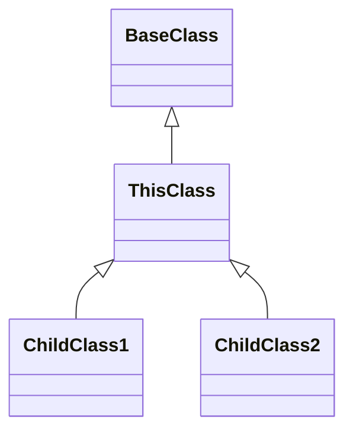
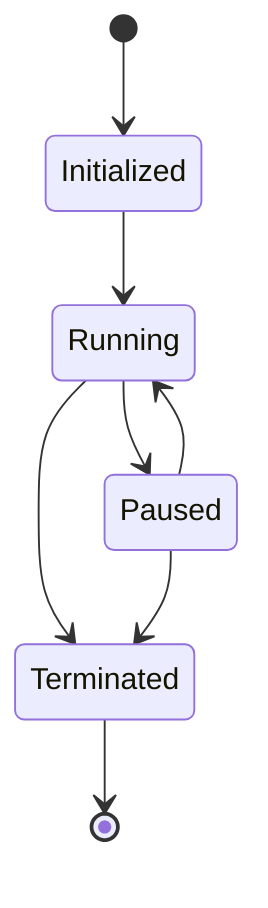
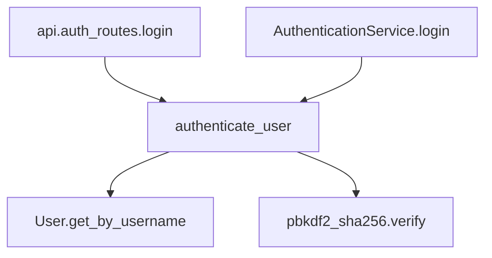

# CodeDoc Phase 1B: LLM-Optimized Documentation Technical Design

## 1. Overview

This document outlines the technical design for Phase 1B of the CodeDoc project: LLM-Optimized Documentation. This phase builds upon the foundation established in Phase 1 to create documentation specifically optimized for large language model (LLM) analysis of codebases. The goal is to enhance the documentation format, structure, and content to maximize an LLM's ability to understand, reason about, and answer questions concerning the codebase.

## 2. Objectives

Phase 1B aims to achieve the following objectives:

1. Enhance the documentation format and structure to optimize for LLM processing
2. Implement comprehensive relationship mapping between code elements
3. Enrich documentation with contextual explanations and implementation rationales
4. Create bidirectional cross-references for improved navigation
5. Add structured metadata to provide context for code elements
6. Document runtime behavior and interaction patterns
7. Standardize the documentation format for consistency and completeness

## 3. System Architecture

### 3.1 Component Overview

```
codedoc/
├── core/                   # Core data structures (existing)
├── parsers/                # Language-specific parsers (existing)
├── enhancers/              # New components for documentation enhancement
│   ├── relationship_mapper.py  # Maps relationships between entities
│   ├── metadata_enricher.py    # Adds structured metadata
│   ├── context_generator.py    # Generates contextual explanations
│   ├── runtime_analyzer.py     # Documents runtime behavior
│   ├── reference_builder.py    # Creates bidirectional references
├── exporters/              # Enhanced documentation generators
│   ├── base_generator.py   # Extended with new capabilities
│   ├── markdown_generator.py   # Enhanced for LLM-optimized output
│   ├── compiled_doc_generator.py  # Creates unified documentation
│   ├── template_manager.py     # Manages documentation templates
├── templates/              # Documentation templates
│   ├── module_template.md     # Template for module documentation
│   ├── class_template.md      # Template for class documentation
│   ├── function_template.md   # Template for function documentation
│   ├── relationship_template.md  # Template for relationship maps
├── utils/                  # Utility functions (existing + new)
├── tests/                  # Test suite (enhanced)
```

### 3.2 Data Flow

1. **Input**: Parsed code entities from Phase 1
2. **Processing Steps**:
   a. Entity Relationship Mapping
   b. Metadata Enrichment
   c. Context Generation
   d. Runtime Analysis
   e. Reference Building
3. **Output**: Enhanced LLM-optimized documentation in various formats

## 4. Technical Design

### 4.1 Documentation Format Enhancement

#### 4.1.1 Standardized Templates

We will create a set of standardized templates for different entity types with consistent sections:

**Module Template**:
```markdown
# Module `{module_name}`

## Metadata
- **Path**: {file_path}
- **Version**: {version}
- **Last Modified**: {last_modified}
- **Stability**: {stability_status}

## Purpose
{purpose_description}

## Usage
{usage_guidelines}

## Implementation Notes
{implementation_details}

## Dependencies
{dependency_list}

## Imports
```python
{import_statements}
```

## API Reference
{api_reference}

## Variables
{variables_list}

## Functions
{functions_list}

## Classes
{classes_list}

## Relationships
{relationship_map}
```

Similar templates will be created for classes, functions, and other entity types.

#### 4.1.2 Frontmatter Metadata

All documentation files will include YAML frontmatter for structured metadata:

```yaml
---
type: module
name: example_module
path: /path/to/example_module.py
version: 1.0.0
last_modified: 2023-03-15
stability: stable
tags: [core, utility]
dependencies: [module1, module2]
---
```

### 4.2 Relationship Mapping

#### 4.2.1 RelationshipMapper

We will implement a `RelationshipMapper` that analyzes entities and builds relationship maps:

```python
class RelationshipMapper:
    def __init__(self, entities):
        self.entities = entities
        self.relationships = {}
    
    def map_import_dependencies(self):
        """Map import dependencies between modules."""
        # Implementation
    
    def map_inheritance_hierarchies(self):
        """Map class inheritance hierarchies."""
        # Implementation
    
    def map_function_calls(self):
        """Map function call relationships."""
        # Implementation
    
    def map_data_dependencies(self):
        """Map data dependencies between entities."""
        # Implementation
    
    def generate_relationship_map(self, entity):
        """Generate a relationship map for a specific entity."""
        # Implementation
```

#### 4.2.2 Relationship Visualization

Relationships will be visualized in documentation using:

1. Structured lists for simple relationships
2. Markdown tables for more complex relationships
3. Mermaid diagrams for visual representation of complex relationships

Example relationship map in documentation:

```markdown
## Relationships

### Dependencies
- **Imports**: module1, module2, module3
- **Imported By**: module4, module5

### Class Hierarchy


### Function Calls
- **Calls**: function1(), function2(), Class.method()
- **Called By**: function3(), Class2.method()
```

### 4.3 Contextual Explanations

#### 4.3.1 ContextGenerator

We will implement a `ContextGenerator` for generating contextual explanations:

```python
class ContextGenerator:
    def __init__(self, entities):
        self.entities = entities
    
    def generate_purpose_description(self, entity):
        """Generate a detailed purpose description."""
        # Implementation
    
    def generate_implementation_notes(self, entity):
        """Generate notes about implementation details."""
        # Implementation
    
    def generate_usage_guidelines(self, entity):
        """Generate guidelines for using this entity."""
        # Implementation
    
    def generate_algorithm_explanation(self, entity):
        """Generate explanation of algorithms used."""
        # Implementation
```

#### 4.3.2 Implementation Notes Section

Documentation will include detailed implementation notes:

```markdown
## Implementation Notes

This module implements the Observer pattern for event handling. The `EventEmitter` 
class maintains a registry of event listeners and notifies them when events occur.

### Algorithm Details

The event dispatching uses a priority queue to ensure events are processed in 
order of importance. This provides O(log n) performance for event registration 
and O(n) for event dispatching where n is the number of listeners.

### Design Decisions

A dictionary-based implementation was chosen over a list-based approach to optimize
lookup performance. This trades memory usage for dispatch speed.
```

### 4.4 Bidirectional Cross-References

#### 4.4.1 ReferenceBuilder

We will implement a `ReferenceBuilder` for creating comprehensive cross-references:

```python
class ReferenceBuilder:
    def __init__(self, entities):
        self.entities = entities
        self.references = {}
    
    def build_inheritance_references(self):
        """Build references for class inheritance relationships."""
        # Implementation
    
    def build_function_references(self):
        """Build references for function calls and references."""
        # Implementation
    
    def build_module_references(self):
        """Build references for module dependencies."""
        # Implementation
    
    def generate_reference_map(self, entity):
        """Generate a complete reference map for an entity."""
        # Implementation
```

#### 4.4.2 Reference Format

References will use a consistent format:

```markdown
### Related Components

- **Parent Class**: [BaseClass](../classes/BaseClass.md) - This class inherits from BaseClass
- **Child Classes**: 
  - [ChildClass1](../classes/ChildClass1.md) - Extends this class with additional validation
  - [ChildClass2](../classes/ChildClass2.md) - Specialized implementation for network operations
- **Used By**: 
  - [AuthenticationService](../services/AuthenticationService.md) - Uses this class for user validation
  - [UserController](../controllers/UserController.md) - Creates instances for user operations
```

### 4.5 Metadata Enrichment

#### 4.5.1 MetadataEnricher

We will implement a `MetadataEnricher` for adding structured metadata:

```python
class MetadataEnricher:
    def __init__(self, entities):
        self.entities = entities
    
    def extract_version_info(self, entity):
        """Extract version information from docstrings or git history."""
        # Implementation
    
    def determine_stability(self, entity):
        """Determine the stability status of an entity."""
        # Implementation
    
    def extract_performance_characteristics(self, entity):
        """Extract or infer performance characteristics."""
        # Implementation
    
    def generate_metadata(self, entity):
        """Generate complete metadata for an entity."""
        # Implementation
```

#### 4.5.2 Metadata Format

Metadata will be included in frontmatter and dedicated sections:

```markdown
## Metadata

- **Version**: 1.2.0
- **Added**: v0.9.0
- **Modified**: v1.2.0 (Added parameter validation)
- **Stability**: Stable
- **Deprecated**: No
- **Complexity**: O(n log n)
- **Thread Safety**: Thread-safe
```

### 4.6 Runtime Behavior Documentation

#### 4.6.1 RuntimeAnalyzer

We will implement a `RuntimeAnalyzer` for documenting runtime behavior:

```python
class RuntimeAnalyzer:
    def __init__(self, entities):
        self.entities = entities
    
    def analyze_state_transitions(self, entity):
        """Analyze state transitions for classes and functions."""
        # Implementation
    
    def analyze_async_patterns(self, entity):
        """Analyze asynchronous patterns and behavior."""
        # Implementation
    
    def analyze_error_handling(self, entity):
        """Analyze error handling patterns."""
        # Implementation
    
    def generate_runtime_documentation(self, entity):
        """Generate documentation about runtime behavior."""
        # Implementation
```

#### 4.6.2 Runtime Behavior Format

Runtime behavior will be documented in dedicated sections:

```markdown
## Runtime Behavior

### State Transitions


### Error Handling
This component uses a cascading error handling approach:
1. Attempts to handle errors at the lowest level
2. Propagates to the caller if unhandled
3. Logs all errors at appropriate levels

### Asynchronous Behavior
This component uses callbacks for asynchronous operations with the following pattern:
```python
component.operation(data, on_success=success_handler, on_error=error_handler)
```
```

### 4.7 Compiled Documentation

#### 4.7.1 CompiledDocGenerator

We will implement a `CompiledDocGenerator` for creating unified documentation:

```python
class CompiledDocGenerator:
    def __init__(self, entities, templates):
        self.entities = entities
        self.templates = templates
    
    def compile_module_documentation(self, module):
        """Compile comprehensive documentation for a module and all its components."""
        # Implementation
    
    def compile_package_documentation(self, package):
        """Compile documentation for a package and all its modules."""
        # Implementation
    
    def compile_codebase_documentation(self):
        """Compile documentation for the entire codebase."""
        # Implementation
```

#### 4.7.2 Compiled Documentation Format

Compiled documentation will combine multiple related entities in a single file:

```markdown
# Module `authentication`

[module documentation]

---

# Class `User`

[class documentation]

---

# Function `authenticate_user`

[function documentation]

---

# Relationships

[comprehensive relationship map]
```

## 5. Implementation Plan

### 5.1 Phase 1: Template and Infrastructure

1. Create documentation templates for all entity types
2. Extend the base generator to support the new templates
3. Implement the template manager
4. Add metadata structure support

### 5.2 Phase 2: Relationship Mapping

1. Implement the RelationshipMapper
2. Add support for inheritance mapping
3. Add support for function call mapping
4. Add support for module dependency mapping
5. Implement relationship visualization

### 5.3 Phase 3: Content Enhancement

1. Implement the ContextGenerator
2. Implement the MetadataEnricher
3. Implement the ReferenceBuilder
4. Implement the RuntimeAnalyzer

### 5.4 Phase 4: Compiled Documentation

1. Implement the CompiledDocGenerator
2. Create unified documentation views
3. Implement linking between compiled documents

### 5.5 Phase 5: Testing and Integration

1. Create unit tests for all new components
2. Create integration tests for the entire pipeline
3. Test with real-world codebases
4. Documentation and examples

## 6. API Design

### 6.1 Enhanced Generator Configuration

```python
@dataclass
class EnhancedGeneratorConfig(GeneratorConfig):
    # Existing fields from Phase 1
    
    # New fields for Phase 1B
    include_relationships: bool = True
    include_runtime_behavior: bool = True
    include_implementation_notes: bool = True
    include_frontmatter: bool = True
    relationship_visualization: str = "mermaid"  # "mermaid", "text", "none"
    metadata_level: str = "detailed"  # "minimal", "standard", "detailed"
    compilation_mode: str = "separate"  # "separate", "module", "package"
```

### 6.2 RelationshipMap Interface

```python
class RelationshipMap:
    def __init__(self):
        self.imports = []
        self.imported_by = []
        self.inherits_from = []
        self.inherited_by = []
        self.calls = []
        self.called_by = []
        self.uses = []
        self.used_by = []
    
    def to_markdown(self, visualization_type="text"):
        """Convert relationship map to markdown format."""
        
    def to_dict(self):
        """Convert relationship map to dictionary format."""
```

### 6.3 Extended Entity Interface

```python
class EnhancedEntityMixin:
    """Mixin to add enhanced documentation capabilities to entities."""
    
    def get_relationships(self) -> RelationshipMap:
        """Get all relationships for this entity."""
        
    def get_metadata(self) -> dict:
        """Get enriched metadata for this entity."""
        
    def get_implementation_notes(self) -> str:
        """Get implementation notes for this entity."""
        
    def get_runtime_behavior(self) -> dict:
        """Get runtime behavior documentation for this entity."""
```

## 7. Testing Strategy

### 7.1 Unit Tests

1. Template rendering tests
2. Relationship mapping tests
3. Metadata extraction tests
4. Reference building tests
5. Runtime analysis tests

### 7.2 Integration Tests

1. End-to-end documentation generation tests
2. Compiled documentation tests
3. Cross-reference integrity tests

### 7.3 Validation Tests

1. Generated documentation review
2. LLM comprehension tests
3. Documentation completeness tests

## 8. Performance Considerations

1. Incremental documentation generation to avoid regenerating unchanged documentation
2. Caching of relationship maps and metadata
3. Parallel processing for independence documentation tasks
4. Memory usage optimization for large codebases

## 9. Example Documentation Output

### 9.1 Enhanced Module Documentation

```markdown
---
type: module
name: authentication
path: /app/auth/authentication.py
version: 1.2.0
last_modified: 2023-03-15
stability: stable
tags: [auth, security, core]
---

# Module `authentication`

## Purpose
This module provides user authentication services for the application, including 
password verification, token generation, and session management.

## Implementation Notes
The authentication system uses JWT (JSON Web Tokens) for stateless authentication. 
Tokens are signed using RS256 (RSA Signature with SHA-256) for enhanced security.

### Design Decisions
- Stateless authentication was chosen over session-based to improve scalability
- Token expiration is set to 24 hours based on security policy requirements
- Refresh tokens are stored in a database with reference to the user

## Dependencies
- **External Libraries**: pyjwt, bcrypt, passlib
- **Internal Modules**: users, config, database

## Imports
```python
import jwt
import bcrypt
from datetime import datetime, timedelta
from passlib.hash import pbkdf2_sha256
from .. import config
from ..users import User
from ..database import get_session
```

## API Reference

### Functions
- [`authenticate_user(username, password)`](#function-authenticate_user)
- [`generate_token(user)`](#function-generate_token)
- [`verify_token(token)`](#function-verify_token)

### Classes
- [`AuthenticationService`](#class-authenticationservice)
- [`TokenManager`](#class-tokenmanager)

## Relationships

### Dependencies
- **Imports**: users, config, database
- **Imported By**: api.auth_routes, api.user_routes, middleware.auth_middleware

### Function Calls
- **Function `authenticate_user`**:
  - Calls: `User.get_by_username()`, `pbkdf2_sha256.verify()`
  - Called By: `api.auth_routes.login`, `AuthenticationService.login`



## Runtime Behavior

### Error Handling
Authentication errors are handled by raising specific exceptions:
- `AuthenticationError`: Base class for all authentication errors
- `InvalidCredentialsError`: Raised when credentials are invalid
- `TokenExpiredError`: Raised when a token has expired

### Performance Characteristics
- Password verification: O(1) time complexity
- Token generation: O(1) time complexity
- Token verification: O(1) time complexity

---

## Function `authenticate_user`

### Signature
```python
def authenticate_user(username: str, password: str) -> User:
```

### Purpose
Authenticates a user with the provided username and password.

### Parameters
- **username** (str): The username of the user to authenticate
- **password** (str): The password to verify

### Returns
- **User**: The authenticated user object

### Raises
- **InvalidCredentialsError**: If the username or password is incorrect

### Implementation Notes
The function first retrieves the user from the database, then verifies the
password hash. Password comparison uses constant-time comparison to prevent
timing attacks.

### Example Usage
```python
try:
    user = authenticate_user("john_doe", "secure_password")
    print(f"Authenticated: {user.name}")
except InvalidCredentialsError:
    print("Authentication failed")
```

### Relationships
- **Calls**: `User.get_by_username()`, `pbkdf2_sha256.verify()`
- **Called By**: `api.auth_routes.login`, `AuthenticationService.login`

---

[Additional functions and classes...]
```

## 10. Conclusion

The LLM-Optimized Documentation phase (Phase 1B) will significantly enhance the utility of CodeDoc for AI-assisted code understanding. By implementing structured templates, relationship mapping, contextual explanations, and comprehensive metadata, we will create documentation that enables LLMs to develop a much deeper understanding of codebases.

This enhanced documentation will maintain human readability while providing the detailed context and structured information that LLMs require for accurate code analysis and question answering. 